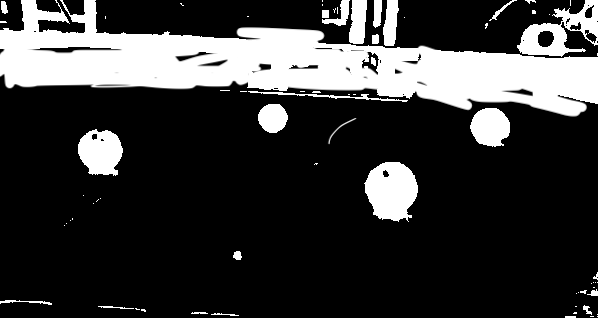
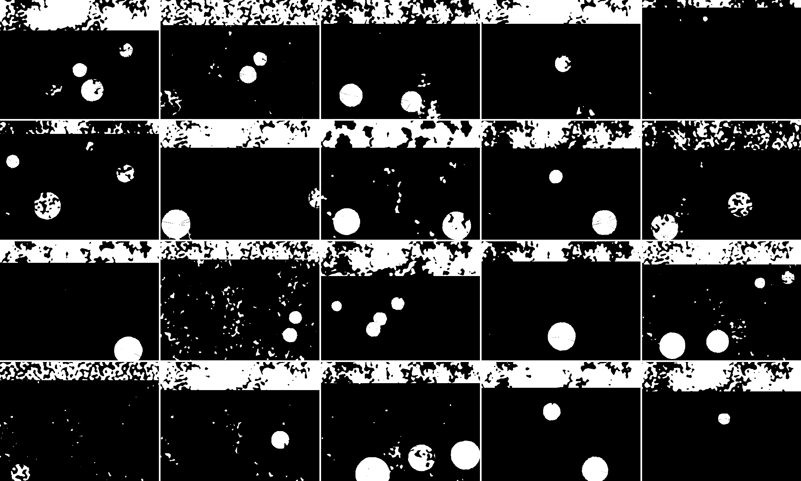

# Ball Detection Simulator

An OpenSimplex based simulator that aims to generate realistic looking robotic sensory imagery. This simulator was used to train a neural network for MASLAB 2018 Robotics Competition. 

  

  

